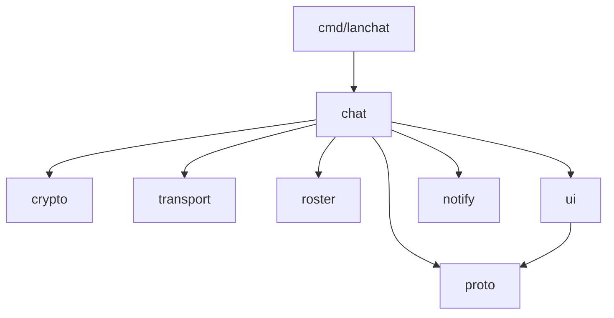

# Architecture

This document is for people working on `lanchat`. For usage, see the
[README](../README.md).

## Design philosophy

`lanchat` has **no server and no state**. Every instance is a peer that sends to
and listens on a UDP multicast group derived from the room name. That single
decision drives everything else:

- **Nothing to run or keep up.** Peers join and leave freely; the conversation
  can't "go down" because nobody is hosting it.
- **Truly ephemeral.** UDP is stateless — you only receive datagrams while you
  are listening, and nothing is ever written to disk.
- **Isolated by encryption, not by address.** Every datagram is encrypted with a
  key derived from `(room, passphrase)`. A wrong key simply fails to decrypt, so
  rooms cannot read each other even though they share one port.

## Package layout

```
cmd/lanchat/          CLI entry point — flags, usage, key resolution, wiring
internal/
  chat/               composition root: builds a session and runs the loops
  crypto/             key derivation + AES-256-GCM wire framing
  notify/             best-effort desktop notifications: snooze + rate-limit
                      gating, per-OS senders (osascript / PowerShell / libnotify)
  proto/              Msg record, seq numbers, dedup, bounded encoding, mentions
  roster/             presence tracking (who is here right now)
  transport/          UDP multicast + directed broadcast, interface tracking
  ui/                 raw-mode line editor with Tab completion, thread-safe
                      printer, mention alerts, boss-key decoy + replay buffer
```

The dependency direction is strictly one-way — nothing in `internal/` imports
`chat`, and only `ui` and `chat` depend on `proto`:



## Data flow

**Sending** a line typed by the user:

```
UI.commit → chat.handleLine (sanitize + rune/byte clamp) → proto.Msg
          → Msg.EncodeBounded (JSON ≤ 1200 B, body trimmed to fit)
          → crypto.Seal (AES-256-GCM)
          → transport.Send (multicast on every interface
                            + directed broadcast per subnet)
```

**Receiving** a datagram off the wire (64 KB read buffer, so an oversized frame
can never be truncated into a silent decrypt failure):

```
transport.Read → crypto.Open ─(wrong key)─▶ dropped
              → json.Unmarshal → drop own echo (by instance id)
              → proto.Dedup.FirstSeen ─(duplicate)─▶ dropped
              → roster.Seen (presence, rename detection)
              → proto.Sanitize + clamp → UI.Chat / UI.Action
```

Duplicates are expected and normal: each message is sent over multicast on
every usable interface **and** as a directed-broadcast copy per subnet, and a
host may receive on several interfaces. `proto.Dedup` keys on
`(instance-id, sequence-number)` so each logical message is shown exactly once.

## Wire format

Each datagram is a self-describing frame:

```
magic (4 bytes) │ nonce (12 bytes) │ AES-256-GCM ciphertext + tag
    "TC02"      │  random per-msg  │  encrypts the JSON-encoded proto.Msg
```

- The **key** is `PBKDF2-HMAC-SHA256(passphrase, salt="tchat-v2|room|"+room,
  210_000 iters, 32 bytes)`. Folding the room name into the salt means the same
  passphrase in two rooms yields two different keys.
- The **magic** tag lets `crypto.Open` reject foreign/corrupt packets cheaply
  before attempting decryption; bump it on any incompatible wire change.
- The **multicast group** is `239.255.<a>.<b>` where `(a, b)` is the first pair
  of `SHA-256("tchat-v2|group|"+room)` that doesn't collide with a well-known
  address in the scope (SSDP `239.255.255.250`, SLPv2 `239.255.255.253`) — a
  deterministic address that never shares a group with discovery chatter.
  Multicast TTL defaults to **1**, so datagrams never leave the local segment
  (raisable with `-ttl` for LANs that route multicast).
- **Frames never fragment.** `Msg.EncodeBounded` caps the JSON payload at
  1200 bytes (trimming only the body, at a UTF-8 rune boundary, with JSON's
  HTML escaping disabled so `<` can't 6×-inflate a frame); with the 32-byte
  frame overhead that is comfortably inside the 1472-byte UDP payload of a
  1500-MTU network. Fragmented UDP is the first casualty on real-world Wi-Fi,
  so this bound is what keeps long messages deliverable.

## Network resilience

Naive multicast fails on real networks; `transport` layers its way around the
common failure modes:

| Scenario | Countermeasure |
| -------- | -------------- |
| Machine on Ethernet **and** Wi-Fi (two segments) | multicast is sent on *every* usable interface |
| Office Wi-Fi filters multicast (IGMP snooping, no querier) | a directed-broadcast copy (`x.y.z.255`) per subnet |
| Active VPN owns the default route | auto-detection skips point-to-point tunnels; directed broadcast never follows the default route |
| AP roam / sleep-wake / DHCP change | interfaces re-scanned every 20 s; group re-joined on new ones |
| Multi-subnet campus that routes multicast | `-ttl n` raises the TTL (default stays 1 for privacy) |
| Burst loss at the socket | 1 MB kernel receive buffer |
| Room hash colliding with SSDP/SLP groups | reserved 239.255.x.y pairs are skipped |

## Concurrency model

A running session has five long-lived goroutines plus the main loop:

| Goroutine        | Responsibility                                    |
| ---------------- | ------------------------------------------------- |
| `ui.Run`         | reads keystrokes, delivers finished lines         |
| `chat.recvLoop`  | decrypts and dispatches incoming datagrams        |
| `chat.presenceLoop` | sends a heartbeat ping every 4s                |
| `chat.expireLoop`   | drops peers unheard-from past the TTL (13s)    |
| `transport.rescanLoop` | refreshes interfaces / multicast membership |
| main loop        | ranges over `ui.Lines`, handles input & commands  |

(plus a short-lived jittered goroutine per received join — see Presence — and
a fire-and-forget goroutine per delivered desktop notification, so the receive
loop never waits on an OS helper process).

The `ui` package funnels **every** terminal write through a single mutex, so the
input editor and asynchronous incoming messages never interleave on screen.
`transport` guards its interface lists with a mutex, since sends and re-scans
race. Cleanup (`chat.shutdown`) is guarded by a `sync.Once` and is safe to
trigger from a signal (SIGINT/SIGTERM/SIGHUP), an EOF, or `/quit`; it never
exits the process itself, so `Run` returns normally.

## Presence

Presence is soft state. A peer is considered present when heard from, and
dropped after `presenceTTL` (13s) with no traffic — which also cleanly handles
ungraceful exits (closed laptop, dropped Wi-Fi) where no `leave` was ever sent.
Heartbeat pings every 4s keep otherwise-quiet peers alive.

Two refinements keep the roster feeling instant:

- **Join pong.** On receiving a `join`, every peer answers with one ping after
  a random 100–400 ms delay, so a newcomer's `/who` is accurate within ~½ s
  instead of one heartbeat interval. The jitter prevents a reply storm in a
  full room.
- **Rename detection.** `roster.Seen` returns the previously known nickname;
  when it differs, the client announces "alice is now alicia" — so `/nick` is
  visible to everyone, not just the person renaming.

## Testing

Unit tests live beside the code they cover:

- `internal/crypto` — seal/open round-trip, and the critical property that a
  frame for one room/passphrase cannot be opened under another.
- `internal/proto` — dedup semantics, the control-character sanitizer,
  rune-boundary-safe byte clamping, the size-bounded encoder (budget,
  validity, no HTML escaping), and whole-word mention matching.
- `internal/notify` — the delivery gates (disabled / snoozed / rate-limited),
  snooze replace-and-expire semantics, and notification-body tidying.
- `internal/roster` — join/rename/leave semantics and stable ordering.
- `internal/transport` — deterministic room→group mapping, reserved-group
  avoidance, and directed-broadcast address math.
- `internal/ui` — Tab-completion mechanics (suffixes, cycling, mid-line
  tails) and the boss-mode replay buffer (held lines, silence, cap).
- `internal/chat` — completion filtering and command-candidate rules.

```sh
go test -race ./...
```
