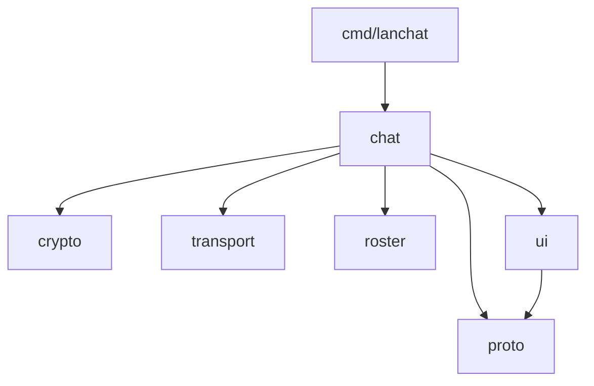

# Architecture

This document is for people working on `lanchat`. For usage, see the
[README](../README.md).

## Design philosophy

`lanchat` has **no server and no state**. Every instance is a peer that sends to
and listens on a UDP multicast group derived from the room name. That single
decision drives everything else:

- **Nothing to run or keep up.** Peers join and leave freely; the conversation
  can't "go down" because nobody is hosting it.
- **Truly ephemeral.** UDP is stateless — you only receive datagrams while you
  are listening, and nothing is ever written to disk.
- **Isolated by encryption, not by address.** Every datagram is encrypted with a
  key derived from `(room, passphrase)`. A wrong key simply fails to decrypt, so
  rooms cannot read each other even though they share one port.

## Package layout

```
cmd/lanchat/          CLI entry point — flags, usage, key resolution, wiring
internal/
  chat/               composition root: builds a session and runs the loops
  crypto/             key derivation + AES-256-GCM wire framing
  proto/              the Msg record, sequence numbers, dedup, text sanitizing
  roster/             presence tracking (who is here right now)
  transport/          UDP multicast + broadcast, interface selection, sockopts
  ui/                 raw-mode line editor, thread-safe printer, boss-key decoy
legacy/               original TCP-relay prototype, kept for reference (unbuilt)
```

The dependency direction is strictly one-way — nothing in `internal/` imports
`chat`, and only `ui` and `chat` depend on `proto`:



## Data flow

**Sending** a line typed by the user:

```
UI.commit → chat.handleLine → proto.Msg → json.Marshal
          → crypto.Seal (AES-256-GCM) → transport.Send (multicast + broadcast)
```

**Receiving** a datagram off the wire:

```
transport.Read → crypto.Open ─(wrong key)─▶ dropped
              → json.Unmarshal → drop own echo (by instance id)
              → proto.Dedup.FirstSeen ─(duplicate)─▶ dropped
              → roster.Seen (presence) → proto.Sanitize → UI.Chat / UI.Action
```

Duplicates are expected and normal: each message is sent over **both** multicast
and broadcast, and a host may receive on several interfaces. `proto.Dedup` keys
on `(instance-id, sequence-number)` so each logical message is shown exactly
once.

## Wire format

Each datagram is a self-describing frame:

```
magic (4 bytes) │ nonce (12 bytes) │ AES-256-GCM ciphertext + tag
    "TC02"      │  random per-msg  │  encrypts the JSON-encoded proto.Msg
```

- The **key** is `PBKDF2-HMAC-SHA256(passphrase, salt="tchat-v2|room|"+room,
  210_000 iters, 32 bytes)`. Folding the room name into the salt means the same
  passphrase in two rooms yields two different keys.
- The **magic** tag lets `crypto.Open` reject foreign/corrupt packets cheaply
  before attempting decryption; bump it on any incompatible wire change.
- The **multicast group** is `239.255.<h[0]>.<h[1]>` where `h = SHA-256(
  "tchat-v2|group|"+room)`, i.e. a deterministic address in the organization-
  local scope. Multicast TTL is **1**, so datagrams never leave the local
  segment.

## Concurrency model

A running session has four goroutines plus the main loop:

| Goroutine        | Responsibility                                    |
| ---------------- | ------------------------------------------------- |
| `ui.Run`         | reads keystrokes, delivers finished lines         |
| `chat.recvLoop`  | decrypts and dispatches incoming datagrams        |
| `chat.presenceLoop` | sends a heartbeat ping every 4s                |
| `chat.expireLoop`   | drops peers unheard-from past the TTL (13s)    |
| main loop        | ranges over `ui.Lines`, handles input & commands  |

The `ui` package funnels **every** terminal write through a single mutex, so the
input editor and asynchronous incoming messages never interleave on screen.
Shutdown is guarded by a `sync.Once` and is safe to trigger from a signal, an
EOF, or `/quit`.

## Presence

Presence is soft state. A peer is considered present when heard from, and
dropped after `presenceTTL` (13s) with no traffic — which also cleanly handles
ungraceful exits (closed laptop, dropped Wi-Fi) where no `leave` was ever sent.
Heartbeat pings every 4s keep otherwise-quiet peers alive.

## Testing

Unit tests live beside the code they cover:

- `internal/crypto` — seal/open round-trip, and the critical property that a
  frame for one room/passphrase cannot be opened under another.
- `internal/proto` — dedup semantics and the control-character sanitizer.
- `internal/transport` — deterministic room→group mapping.

```sh
go test ./...
```
